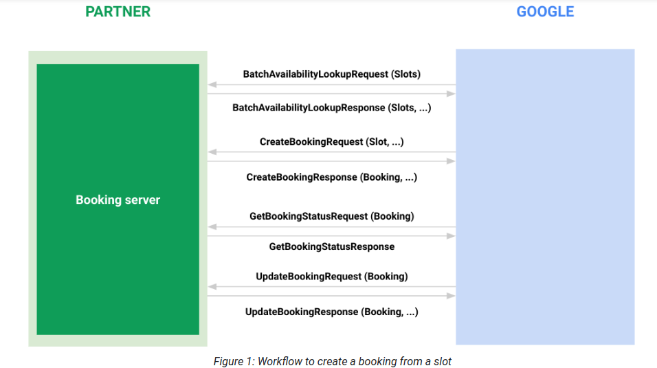
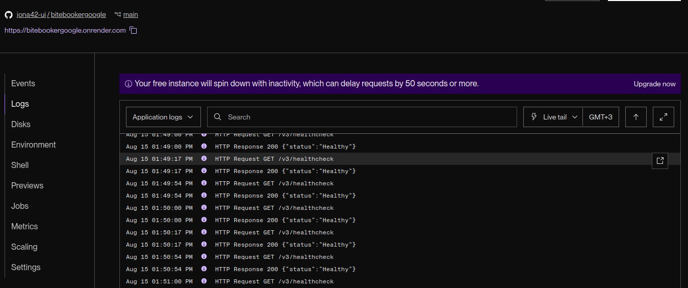

# BiteBooker Google Booking Server



## Overview

This repository contains the implementation of a booking server using Node.js, designed to integrate with Google's Maps Booking API (API v3). The server supports core booking operations and real-time updates (RTU) for bookings made through Google services like Google Maps and Google Search.

## Features

- **Booking Server API**: Implements the core methods required for booking operations, including `HealthCheck`, `BatchAvailabilityLookup`, `CreateBooking`, and `UpdateBooking`.
- **Real-Time Updates (RTU)**: Allows for sending notifications about booking status changes to Google.
- **Deployed on Render**: The server is deployed on Render at the custom domain: [https://bitebookergoogle.onrender.com](https://bitebookergoogle.onrender.com).

## Repository Structure

- **`apiv3methods.js`**: Contains the implementation of the main booking server methods.
- **`bookingserver.js`**: Sets up the server and defines the routes that handle the different booking operations.
- **`rtu.js`**: Handles the real-time update notifications to Google, ensuring that booking status changes are communicated back to Google in real-time.
- **`.env`**: Environment configuration file containing sensitive data like paths and credentials.
- **`package.json`**: Lists the dependencies required by the Node.js application.

## Getting Started

### Prerequisites

- Node.js (version 14.x or higher)
- A Google Cloud project with the Maps Booking API enabled
- A Render account to deploy the server

### Setup

1. **Clone the repository:**
   ```bash
   git clone git@github.com:jona42-ui/bitebookergoogle.git
   cd bitebookergoogle


2. **Install dependencies:**
   ```bash
   npm install


3. **Set up the environment variables:**
   ```bash
    PORT=portno.
    PRIVATE_KEY_PATH=/path/to/your/private/key
    MERCHANT_USERNAME=username
    AVAIL_USERNAME=username
    SERVICE_USERNAME=username
    BASIC_AUTH_USERNAME=your-username
    BASIC_AUTH_PASSWORD=your-password
    GOOGLE_KEYFILE_PATH=/path/to/your/service-account-key.json


4. **Run the server locally:**
   ```bash
   npm start

5. **Deploy:**


## Real-Time Updates Configuration

- The rtu.js file is responsible for sending booking status notifications back to Google.
- Ensure that the GOOGLE_KEYFILE_PATH environment variable points to the service account key file used for authentication.

## Health Check

- Google will periodically check the health of your booking server using the HealthCheck endpoint. Ensure this endpoint is correctly configured and returns a status of "Healthy".




## Actions Center Configuration

- Once deployed, the booking server's endpoint must be configured in the Google Actions Center under the "Booking Server endpoint and credentials" tab. Use the custom domain provided by Render for this configuration.


